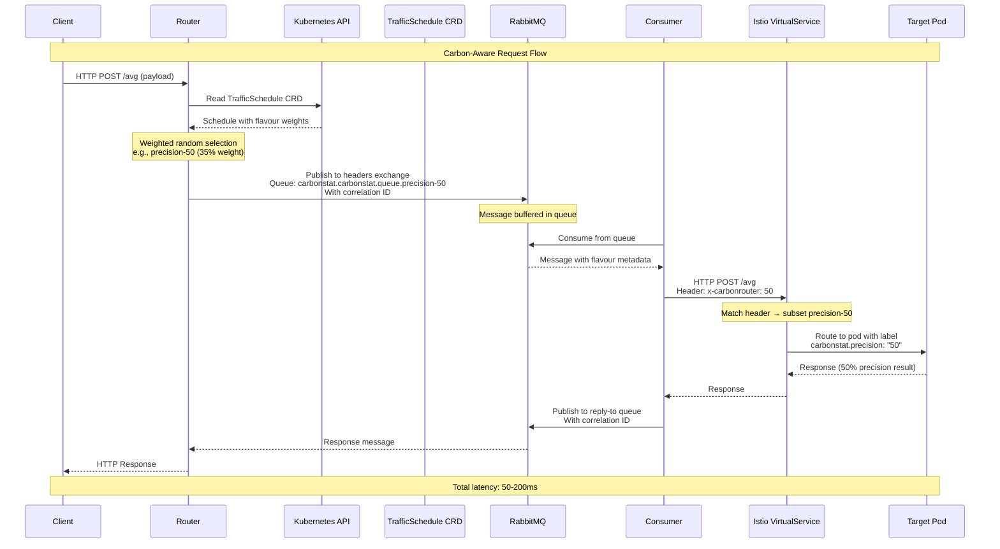
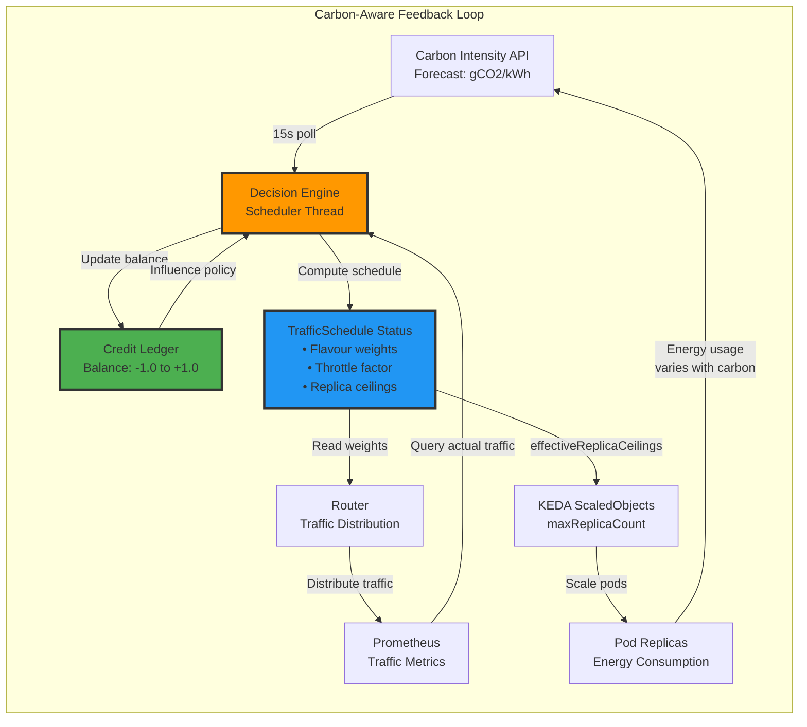

# Carbon-Aware Kubernetes Scheduler - Architecture

This document provides a comprehensive architectural overview of the carbon-aware scheduling system for Kubernetes clusters.

## System Overview

The carbon-aware Kubernetes scheduler is a sophisticated system that optimizes workload scheduling based on carbon intensity forecasts while maintaining quality-of-service guarantees through a credit ledger mechanism. The system consists of multiple components working together to achieve carbon-aware operation:

- **Operator**: Kubernetes-native controller managing the lifecycle of all components
- **Decision Engine**: Computes carbon-aware schedules and scaling directives
- **Buffer Service**: Router and Consumer components that buffer and route traffic
- **RabbitMQ**: Message queue for decoupling and buffering
- **KEDA**: Event-driven autoscaler with carbon-aware throttling
- **Istio**: Service mesh for precision-based traffic routing
- **Target Application**: Multi-precision deployments (e.g., carbonstat)

## Full System Architecture

```mermaid
graph TB
    subgraph "External Services"
        Client[Client Application]
        CarbonAPI[Carbon Intensity API<br/>api.carbonintensity.org.uk]
    end

    subgraph "carbonrouter-system namespace"
        Operator[Operator<br/>Go Controller<br/>Port: 8443 metrics]
        DecisionEngine[Decision Engine<br/>Python Flask<br/>Port: 80 API, 8001 metrics]
        RabbitMQ[RabbitMQ<br/>Port: 5672 AMQP<br/>15672 Management UI]
        Prometheus[Prometheus<br/>Port: 9090]
        Grafana[Grafana<br/>Port: 3000]
        KEDA[KEDA Controller]
    end

    subgraph "Target Namespace (e.g., carbonstat)"
        TrafficSchedule[TrafficSchedule CRD<br/>scheduling.carbonrouter.io/v1alpha1]

        subgraph "Buffer Service"
            Router[Router<br/>Python FastAPI<br/>Port: 8000 HTTP<br/>8001 metrics]
            Consumer[Consumer<br/>Python Async<br/>Port: 8001 metrics]
        end

        subgraph "Istio Resources"
            VirtualService[VirtualService<br/>Header-based routing]
            DestinationRule[DestinationRule<br/>Precision subsets]
        end

        subgraph "Target Application Deployments"
            TargetHigh[carbonstat-high-power<br/>100% precision<br/>Label: carbonstat.precision=100]
            TargetMid[carbonstat-mid-power<br/>50% precision<br/>Label: carbonstat.precision=50]
            TargetLow[carbonstat-low-power<br/>30% precision<br/>Label: carbonstat.precision=30]
        end

        Service[Service: carbonstat<br/>Port: 80<br/>Label: carbonrouter/enabled=true]

        ScaledObjects[KEDA ScaledObjects<br/>Carbon-aware autoscaling]
    end

    %% Request Flow
    Client -->|1. HTTP Request| Router
    Router -->|2. Read schedule| TrafficSchedule
    Router -->|3. Publish with flavour<br/>RPC pattern| RabbitMQ
    RabbitMQ -->|4. Queue: namespace.service.queue.precision-X| Consumer
    Consumer -->|5. Forward with header<br/>x-carbonrouter: X| VirtualService
    VirtualService -->|6. Route by header| DestinationRule
    DestinationRule -->|7. Subset selection| TargetHigh
    DestinationRule -->|7. Subset selection| TargetMid
    DestinationRule -->|7. Subset selection| TargetLow
    Consumer -->|8. RPC Response| RabbitMQ
    RabbitMQ -->|9. Reply-to queue| Router
    Router -->|10. HTTP Response| Client

    %% Control Plane Flow
    Operator -->|Discover precision deployments<br/>via labels| TargetHigh
    Operator -->|Discover precision deployments<br/>via labels| TargetMid
    Operator -->|Discover precision deployments<br/>via labels| TargetLow
    Operator -->|PUT /config| DecisionEngine
    Operator -->|GET /schedule| DecisionEngine
    Operator -->|Update status| TrafficSchedule
    Operator -->|Create/Update| Router
    Operator -->|Create/Update| Consumer
    Operator -->|Create/Update| VirtualService
    Operator -->|Create/Update| DestinationRule
    Operator -->|Create/Update maxReplicaCount| ScaledObjects

    %% Carbon-Aware Scheduling Flow
    DecisionEngine -->|Fetch forecast<br/>every 15s| CarbonAPI
    DecisionEngine -->|Query traffic metrics<br/>every 15s| Prometheus
    DecisionEngine -.->|Credit Ledger<br/>Feedback Loop| DecisionEngine
    DecisionEngine -->|Compute throttle factor<br/>& replica ceilings| TrafficSchedule

    %% KEDA Autoscaling
    ScaledObjects -->|Monitor queue depth| RabbitMQ
    ScaledObjects -->|Query metrics| Prometheus
    KEDA -->|Apply carbon-aware<br/>maxReplicaCount| ScaledObjects
    ScaledObjects -->|Scale| Consumer
    ScaledObjects -->|Scale| TargetHigh
    ScaledObjects -->|Scale| TargetMid
    ScaledObjects -->|Scale| TargetLow

    %% Monitoring
    Router -->|Expose metrics| Prometheus
    Consumer -->|Expose metrics| Prometheus
    DecisionEngine -->|Expose metrics| Prometheus
    TargetHigh -->|Expose metrics| Prometheus
    TargetMid -->|Expose metrics| Prometheus
    TargetLow -->|Expose metrics| Prometheus
    Prometheus -->|Visualize| Grafana

    %% Styling
    classDef external fill:#e1f5ff,stroke:#333,stroke-width:2px
    classDef infrastructure fill:#fff4e6,stroke:#333,stroke-width:2px
    classDef buffer fill:#f3e5f5,stroke:#333,stroke-width:2px
    classDef target fill:#e8f5e9,stroke:#333,stroke-width:2px
    classDef crd fill:#fce4ec,stroke:#333,stroke-width:2px

    class Client,CarbonAPI external
    class Operator,DecisionEngine,RabbitMQ,Prometheus,Grafana,KEDA infrastructure
    class Router,Consumer buffer
    class TargetHigh,TargetMid,TargetLow,Service target
    class TrafficSchedule,ScaledObjects crd
```



## Request Flow Sequence

This sequence diagram shows the detailed flow of a single request through the system:



### Request Flow Steps

1. **Client Request**: Client sends HTTP request to Router (port 8000)
2. **Schedule Lookup**: Router reads current schedule from TrafficSchedule CRD
3. **Flavour Selection**: Router selects precision level using weighted random choice
4. **Message Publishing**: Router publishes request to RabbitMQ with flavour metadata and correlation ID
5. **Queue Buffering**: RabbitMQ routes message to precision-specific queue
6. **Consumer Processing**: Consumer worker pool picks up message from queue
7. **Istio Routing**: Consumer forwards request with `x-carbonrouter` header to target service
8. **Subset Selection**: Istio VirtualService routes to appropriate precision subset
9. **Pod Selection**: Istio DestinationRule selects pod based on precision label
10. **Response Path**: Response flows back through Consumer → RabbitMQ → Router → Client

## Carbon-Aware Control Loop

This diagram illustrates the feedback loop that enables carbon-aware operation:



### Control Loop Components

1. **Carbon Forecast**: Decision Engine fetches carbon intensity forecasts every 15 seconds
2. **Traffic Metrics**: Decision Engine queries Prometheus for actual traffic distribution
3. **Credit Update**: Credit ledger tracks quality balance based on realized precision
4. **Schedule Computation**: Decision Engine computes new schedule with flavour weights and throttle factor
5. **Traffic Distribution**: Router reads schedule and distributes requests accordingly
6. **Scaling Directive**: KEDA ScaledObjects receive carbon-aware replica ceilings
7. **Pod Scaling**: KEDA scales pods respecting carbon-aware limits
8. **Energy Impact**: Reduced replicas during high-carbon periods = lower energy consumption

## Key Design Patterns

### 1. Credit Ledger Pattern
- Quality is tracked as a "bank account" over time
- High-precision use "earns" credit (quality surplus)
- Low-precision use "spends" credit (quality deficit)
- Prevents SLO violations by limiting deficit accumulation

### 2. Two-Level Scheduling
- **Traffic Scheduling**: Distributes requests across precision levels based on carbon intensity
- **Resource Scheduling**: Controls replica counts to limit energy consumption during high-carbon periods

### 3. RPC over RabbitMQ
- Decouples router from consumers for buffering and backpressure
- Correlation IDs enable request-response matching
- Headers-based routing for precision targeting

### 4. Carbon-Aware Throttling
- Throttle factor computed from: `min(carbon_intensity_ratio, credit_balance_ratio)`
- Applied as `maxReplicaCount` on KEDA ScaledObjects
- Trades latency for energy savings during high-carbon periods

### 5. Istio Header-Based Routing
- Consumer sets `x-carbonrouter` header with precision value
- Istio VirtualService routes to appropriate subset
- Enables precise traffic steering without DNS/IP changes

## Component Details

### Operator (Go)
- **Location**: `operator/`
- **Role**: Kubernetes controller managing system lifecycle
- **Controllers**:
  - TrafficScheduleReconciler: Manages scheduling configuration
  - FlavourRouterReconciler: Provisions buffer service and routing resources
- **Responsibilities**:
  - Discover precision flavours via labels
  - Create/update Router, Consumer, KEDA ScaledObjects, Istio resources
  - Sync with Decision Engine for schedule updates
  - Apply carbon-aware replica ceilings to ScaledObjects

### Decision Engine (Python Flask)
- **Location**: `decision-engine/`
- **Role**: Computes carbon-aware schedules
- **Architecture**:
  - SchedulerRegistry: Manages multiple SchedulerSession instances
  - SchedulerSession: Long-lived scheduler with background threads
- **Background Threads**:
  - Scheduler Thread: Evaluates schedule every 15s
  - Metrics Polling Thread: Queries Prometheus every 15s
- **Core Components**:
  - FlavourRegistry: Thread-safe flavour management
  - CreditLedger: Quality balance tracking
  - ForecastManager: Carbon intensity forecasts
  - Policy Engine: Scheduling strategy evaluation

### Buffer Service (Python FastAPI)
- **Location**: `buffer-service/`
- **Components**:
  - **Router**: HTTP entrypoint (port 8000) that routes via RabbitMQ
  - **Consumer**: Processes queues and forwards to target services
- **Key Features**:
  - TrafficScheduleManager: Watches CRD for live updates
  - FlavourWorkerManager: Dynamic worker pool management
  - RPC pattern with 60s timeout
  - Retry logic with exponential backoff

### Target Application (Carbonstat)
- **Location**: `carbonstat/`
- **Role**: Sample multi-precision application
- **Flavours**:
  - High Power (100% precision): Full dataset
  - Medium Power (50% precision): Every other element
  - Low Power (30% precision): 1 in 4 elements
- **Deployment**: Three separate deployments with precision labels

## Configuration Parameters

### TrafficSchedule CRD
```yaml
spec:
  scheduler:
    targetError: "0.15"           # Target quality error (15%)
    creditMin: "-1.0"              # Min credit balance
    creditMax: "1.0"               # Max credit balance
    creditWindow: 300              # Smoothing window (seconds)
    policy: "forecast-aware"       # Scheduling policy
    validFor: 60                   # Schedule validity (seconds)
    carbonTarget: "national"       # Carbon API target
    carbonCacheTTL: 300            # Cache TTL (seconds)
```

### Key Tuning Parameters
- **Target Error** (0.15 = 15%): Quality threshold
- **Credit Sensitivity** (0.33): Makes credit "tank" 3× bigger
- **Throttle Floor/Ceiling** (150-350 gCO2/kWh): Carbon thresholds
- **Evaluation Interval** (15s): Schedule recomputation frequency
- **Metrics Poll Interval** (15s): Prometheus query frequency

## Monitoring & Metrics

### Decision Engine Metrics
- `scheduler_credit_balance`: Current credit balance
- `scheduler_processing_throttle`: Throttle factor (0.0-1.0)
- `scheduler_effective_replica_ceiling`: Effective ceiling per component
- `scheduler_forecast_intensity`: Carbon intensity forecasts
- `schedule_flavour_weight`: Weight per flavour

### Router Metrics

- `router_ingress_http_requests_total`: Requests received before queuing
- `router_request_duration_seconds`: End-to-end latency
- `router_schedule_valid_seconds`: Time until schedule expiry

### Consumer Metrics

- `router_http_requests_total`: Requests processed after buffering
- `consumer_messages_total`: Messages consumed by flavour
- `consumer_forward_seconds`: HTTP forward latency

## Namespaces

- **carbonrouter-system**: Core infrastructure (operator, decision engine, RabbitMQ, Prometheus, Grafana, KEDA)
- **Target namespace** (e.g., carbonstat): Application components (buffer service, target deployments, TrafficSchedule CRD)

## Service Ports

| Component | Namespace | Port(s) |
|-----------|-----------|---------|
| carbonstat | carbonstat | 80 |
| buffer-service-router | carbonstat | 8000 (HTTP), 8001 (metrics) |
| buffer-service-consumer | carbonstat | 8001 (metrics) |
| decision-engine | carbonrouter-system | 80 (API), 8001 (metrics) |
| prometheus | carbonrouter-system | 9090 |
| grafana | carbonrouter-system | 3000 |
| rabbitmq | carbonrouter-system | 5672 (AMQP), 15672 (Management UI) |
| operator | carbonrouter-system | 8443 (metrics) |

## External Integrations

- **Carbon Intensity API**: UK National Grid Carbon Intensity API (default)
- **Kubernetes API**: CRD watching and resource management
- **Prometheus API**: Traffic metrics for credit ledger feedback

## How It Works: End-to-End

1. **Setup Phase**:
   - Operator discovers precision deployments via labels
   - Operator creates buffer service, Istio routing, KEDA ScaledObjects
   - Operator configures Decision Engine with flavour information
   - Decision Engine starts background threads for scheduling and metrics

2. **Scheduling Phase** (every 15s):
   - Decision Engine fetches carbon intensity forecast
   - Decision Engine queries Prometheus for actual traffic distribution
   - Credit ledger updates based on realized precision
   - Policy engine computes new schedule with flavour weights
   - Throttle factor computed from carbon intensity + credit balance
   - Effective replica ceilings calculated per component
   - Operator retrieves schedule and updates TrafficSchedule CRD status
   - Operator updates KEDA ScaledObjects with new maxReplicaCount

3. **Request Phase**:
   - Client sends request to Router
   - Router reads schedule from TrafficSchedule CRD
   - Router selects precision level via weighted random
   - Router publishes to RabbitMQ with flavour metadata
   - Consumer processes queue and forwards with Istio header
   - Istio routes to appropriate precision subset
   - Target pod processes with selected precision level
   - Response flows back through Consumer → RabbitMQ → Router → Client

4. **Scaling Phase**:
   - KEDA monitors queue depth, CPU, and Prometheus metrics
   - KEDA scales pods respecting carbon-aware maxReplicaCount
   - During high-carbon periods: Fewer replicas → Lower energy → Higher latency
   - During low-carbon periods: More replicas → Higher energy → Lower latency

## Carbon Reduction Mechanism

The system achieves carbon reduction through two complementary mechanisms:

1. **Precision Shifting**: Preferring low-precision (low-energy) flavours during high-carbon periods
2. **Replica Throttling**: Limiting maximum replicas during high-carbon periods to reduce energy consumption

The credit ledger ensures quality targets are maintained over time by tracking the cumulative quality balance and influencing future scheduling decisions.
