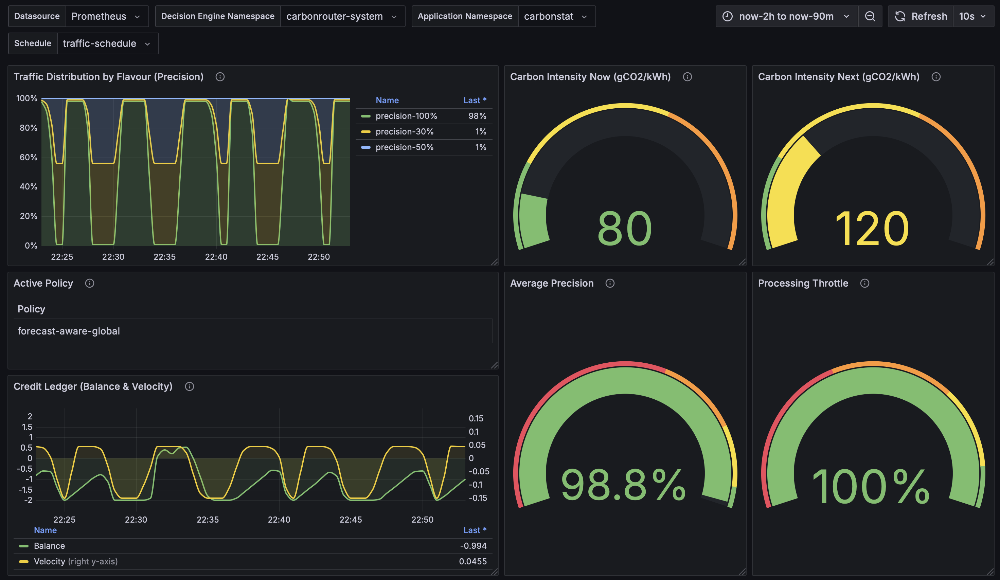
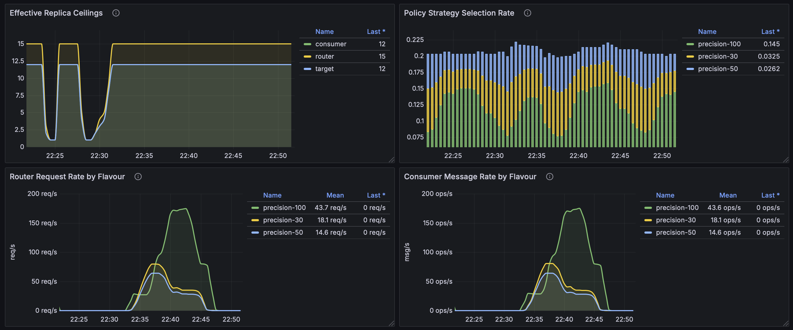

# K8s-CarbonRouter

[](LICENSE)
[](https://kubernetes.io/)
[](https://go.dev/)
[](https://python.org/)
[](https://helm.sh/)
[](https://github.com/belgio99/k8s-carbonrouter/actions)
[](https://github.com/belgio99/k8s-carbonrouter/stargazers)
[](https://greensoftware.foundation/)
[](CONTRIBUTING.md)

A Kubernetes-native reference implementation for carbon-aware workload routing. It
combines a scheduling decision engine, a buffer layer that can steer HTTP
traffic based on carbon-aware schedules, a sample carbon-aware application, and a
Kubernetes operator that keeps everything in sync.

The project originated from the 2025 ESOCC paper "Carbon-aware Software
Services" and demonstrates how to apply precision-based service flavours and
credit-based scheduling to minimise emissions without sacrificing latency goals.

**Author/Maintainer:** Giovanni Bellini

**Thesis Name:** Design and Implementation of a Kubernetes Framework for Carbon-Aware Traffic Scheduling and Routing in Microservices Architectures

**Degree:** MSc in Computer Science, University of Pisa, Dec 2025.

**Supervisors:** Antonio Brogi, Stefano Forti, Jacopo Soldani

## System Overview

<p align="center">
  <picture>
    <source media="(prefers-color-scheme: dark)" srcset="docs/assets/architecture-diagram/architecture-diagram-dark.svg">
    <source media="(prefers-color-scheme: light)" srcset="docs/assets/architecture-diagram/architecture-diagram-light.svg">
    
  </picture>
</p>

Four components work together:

1. **Decision engine** (`decision-engine/`) computes the next routing schedule for
each `TrafficSchedule` custom resource using credit-ledger heuristics and
optionally carbon-intensity forecasts.
2. **Buffer service** (`buffer-service/`) exposes an HTTP entrypoint (`router`),
relays requests through RabbitMQ, and forwards them via the `consumer` to the
selected flavour of the target workload. It honours the latest schedule and
exports detailed Prometheus metrics.
3. **Operator** (`operator/`) reconciles `TrafficSchedule` CRDs and Kubernetes
Services labelled with `carbonrouter/enabled=true`. It discovers available
flavours, pushes runtime configuration to the decision engine, and provisions
supporting resources (DestinationsRules, KEDA ScaledObjects, Deployments, etc.).
4. **Carbonstat sample app** (`carbonstat/`) is a simple Flask service exposing
three precision flavours (`high`, `mid`, `low`) to showcase the impact of
carbon-aware routing.

Supporting content lives under `helm/` (Helm charts), `demo/` (example
manifests), `docs/` (design notes), and `grafana/` (dashboards).

## Quick Start

> The repository assumes a working Kubernetes cluster (Kind or K3s works well),
> access to a RabbitMQ endpoint, and Docker or another OCI builder. For a full
> reference deployment see the Helm charts under `helm/carbonrouter-umbrella`.

1. **Build container images**

   ```bash
   make docker-build docker-push IMG=<registry>/carbonrouter-operator:dev --directory operator
   docker build -t <registry>/carbonrouter-router:dev -f buffer-service/Dockerfile.router buffer-service
   docker build -t <registry>/carbonrouter-consumer:dev -f buffer-service/Dockerfile.consumer buffer-service
   docker build -t <registry>/carbonstat:dev carbonstat
   docker build -t <registry>/carbonrouter-decision-engine:dev decision-engine
   ```

2. **Install CRDs and operator**

   ```bash
   make install --directory operator
   make deploy IMG=<registry>/carbonrouter-operator:dev --directory operator
   ```

3. **Deploy the data plane**

   Use the provided Helm charts or the manifests in `demo/` to install RabbitMQ,
the decision engine, buffer service, and the sample carbonstat flavours.

4. **Verify**

   - `kubectl get trafficschedules -A` should show the computed status with
     `validUntil` and flavour weights.
   - Access `http://<router-service>/metrics` and
     `http://<consumer-service>/metrics` for Prometheus metrics.
   - Send HTTP requests to the router and observe flavour distribution in
     RabbitMQ and the carbonstat pods.

## Local Development

- Python components (`buffer-service`, `carbonstat`, `decision-engine`) target
  Python 3.11+. Create a virtual environment and install `requirements.txt`
  before running the scripts with `uvicorn` or `flask`.
- The operator requires Go 1.23+, Kubebuilder tooling, and controller-runtime.
  Common commands are exposed via `make` in `operator/` (e.g. `make test`,
  `make run` for a local manager).
- Helm charts in `helm/` are structured per component and aggregated by the
  umbrella chart `helm/carbonrouter-umbrella`.

## Carbon-Aware Autoscaling

The system implements dynamic autoscaling throttling based on carbon intensity
and quality credit balance. During periods of high carbon intensity or low
quality credits, the decision engine computes reduced replica ceilings that are
automatically applied to KEDA ScaledObjects.

**How it works:**

1. The **decision engine** calculates a throttle factor (0.0-1.0) based on:
   - Current carbon intensity relative to configured thresholds
   - Quality credit balance (higher credits = less throttling)
   - Forecast-aware strategies consider upcoming carbon intensity peaks

2. The throttle factor is applied to each component's `maxReplicaCount`:

   ```text
   effective_ceiling = max(min_replicas, floor(max_replicas × throttle))
   ```

3. The **operator** reads these ceilings from `TrafficSchedule.Status.effectiveReplicaCeilings`
   and dynamically updates KEDA ScaledObjects' `maxReplicaCount` field.

4. **KEDA** respects the reduced ceiling, keeping fewer replicas active even when
   queue depth or CPU utilization would normally trigger scale-up.

This creates a carbon-aware backpressure mechanism: during unfavorable carbon
periods, the system trades increased latency (requests queue in RabbitMQ) for
reduced energy consumption by running fewer replicas. Quality credits prevent
excessive throttling that would violate SLO targets.

**Configuration:**

Set replica bounds in the `TrafficSchedule` spec:

```yaml
apiVersion: scheduling.carbonrouter.io/v1alpha1
kind: TrafficSchedule
spec:
  router:
    autoscaling:
      minReplicaCount: 1
      maxReplicaCount: 10
  consumer:
    autoscaling:
      minReplicaCount: 1
      maxReplicaCount: 15
  target:
    autoscaling:
      minReplicaCount: 0
      maxReplicaCount: 20
```

The decision engine will compute carbon-aware ceilings for `router`, `consumer`,
and `target` components. The `target` ceiling applies to all precision flavour
deployments discovered by the operator.

## Observability

All components export Prometheus metrics:

- Router: ingress request counters (`router_ingress_http_requests_total`),
latency histograms, and schedule TTL gauges.
- Consumer: processed request counters (`router_http_requests_total`), message
  counters, HTTP forward durations, and retry statistics.
- Decision engine: credit ledger gauges, forecast metrics, flavour weight
  gauges, and autoscaling throttle (`scheduler_processing_throttle`) and ceiling
  metrics (`scheduler_replica_ceiling`).
- Operator: controller-runtime metrics once the manager is running.

Grafana dashboards under `grafana/` provide ready-to-import dashboards tailored
for these metrics.

### Dashboard Preview

The TrafficSchedule Status dashboard provides real-time visibility into carbon-aware scheduling decisions:



*Traffic distribution by precision level, carbon intensity gauges, credit ledger balance, and active policy status.*



*Effective replica ceilings, policy strategy selection, and request/message rates by flavour.*

## Repository Layout

- `buffer-service/` - FastAPI router and async consumer connected via RabbitMQ.
- `carbonstat/` - Sample workload with three energy/precision profiles.
- `decision-engine/` - Credit-based scheduler and REST API.
- `operator/` - Go-based controller managing CRDs and routing resources.
- `helm/` - Charts for the operator, buffer service, decision engine, and the
  umbrella deployment.
- `demo/` - Minimal manifests to bootstrap the system in a namespace.
- `docs/` - Design documents such as the credit-based scheduler deep dive.
- `experiments/` - Benchmarking tools, load-testing scripts (Locust), carbon intensity scenarios, and Jupyter notebooks for thesis analysis.

## Contributing

Issues and pull requests are welcome. Please ensure new features include unit or
integration coverage where practical and update the relevant documentation. For
changes to the operator, run `make test` in the `operator/` directory to execute
the Go test suite before submitting.

## License

Copyright 2025 Giovanni Bellini

This project is licensed under the Apache License, Version 2.0. See the [LICENSE](LICENSE) file for details.
