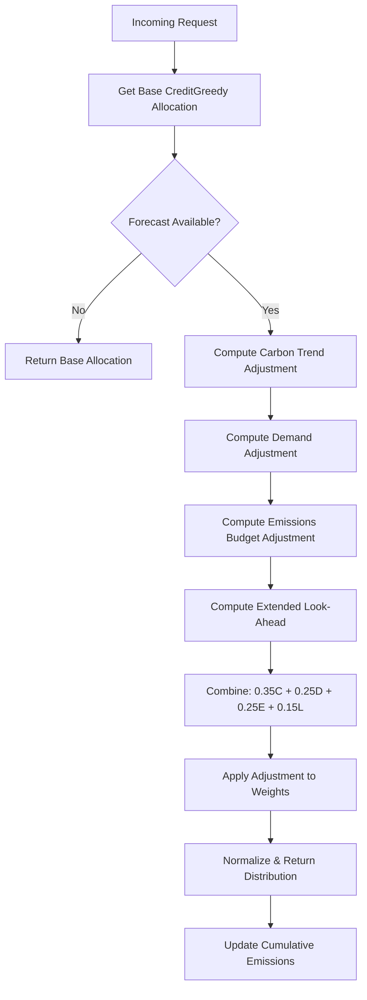

# Forecast-Aware-Global Strategy: Advanced Carbon-Aware Scheduling

## Overview

The **`forecast-aware-global`** strategy is the most comprehensive scheduling policy in the carbon-aware scheduler. It implements a **global optimization approach** that considers all available signals to make scheduling decisions that minimize carbon emissions while maintaining quality constraints.

## Key Features

### 1. Credit/Debt Management ✅
- Tracks cumulative quality credit/debt through the `CreditLedger`
- Balance range: `-1.0` (max debt) to `+1.0` (max credit)
- Credit accumulates when using high-precision (low-carbon) strategies
- Debt accumulates when using low-precision (high-carbon) strategies

### 2. Current Carbon Intensity ✅
- Uses real-time carbon intensity data from the Carbon Intensity API
- Calculates carbon scores for each flavour
- Prioritizes greener flavours based on `carbon_intensity` values

### 3. Short-Term Carbon Forecast ✅
- Analyzes `intensity_now` vs `intensity_next` (30-minute horizon)
- Computes relative trend to predict carbon intensity changes
- **Decision Logic**:
  - Rising intensity (>5%): Conserve credit for future cleaner periods
  - Falling intensity (>5%): Spend credit while intensity is high
  - Stable: No adjustment

### 4. Extended Look-Ahead Forecast ✅
- Analyzes up to 6 forecast points (1.5-3 hours ahead)
- Identifies upcoming very clean or very dirty periods
- **Decision Logic**:
  - Very clean period ahead (<60% of current): Conserve credit
  - Very dirty period ahead (>140% of current): Spend credit now
  - Uses min/max/average over forecast window

### 5. Demand Forecasting ✅
- Anticipates workload spikes using `demand_next` forecasts
- Conserves credit before expected load increases
- **Decision Logic**:
  - Spike expected (>50% increase): Strongly conserve credit
  - Drop expected (>30% decrease): Can spend credit
  - Stable demand: No adjustment

### 6. Cumulative Emissions Budget ✅
- Tracks total carbon emissions: `Σ carbon_intensity per request`
- Compares average emissions per request vs. current intensity
- **Decision Logic**:
  - Emitting >20% above current rate: Push towards greener flavours
  - Emitting <20% below current rate: Can use higher precision
  - On track: No adjustment

## Multi-Factor Scoring Algorithm

The strategy combines all factors with weighted adjustments:

```
total_adjustment = 
    0.35 × carbon_trend_adjustment +      # Short-term carbon forecast
    0.25 × demand_adjustment +             # Workload forecast
    0.25 × emissions_budget_adjustment +   # Cumulative carbon tracking
    0.15 × lookahead_adjustment            # Extended forecast

Clamped to: [-0.5, +0.5]
```

### Adjustment Semantics

- **Positive adjustment** (+): Shift traffic towards **greener** (lower-precision) flavours
- **Negative adjustment** (−): Shift traffic towards **baseline** (higher-precision) flavours

## Configuration

### Enable in TrafficSchedule

```yaml
apiVersion: carbonrouter.carbonshift.io/v1alpha1
kind: TrafficSchedule
metadata:
  name: my-workload
  namespace: default
spec:
  config:
    policy: "forecast-aware-global"  # Enable the advanced strategy
    targetError: 0.1                 # 10% quality error tolerance
    creditMax: 1.0                   # Maximum credit balance
    creditMin: -1.0                  # Maximum debt balance
    creditWindow: 300                # 5-minute smoothing window
```

### Environment Variables

```bash
SCHEDULER_POLICY=forecast-aware-global
TARGET_ERROR=0.1
CREDIT_MAX=1.0
CREDIT_MIN=-1.0
CREDIT_WINDOW=300
```

## Diagnostics & Monitoring

The strategy exports comprehensive diagnostics via Prometheus metrics:

### Core Metrics

```
scheduler_credit_balance{namespace,schedule,policy}
  Current credit balance [-1.0, +1.0]

scheduler_credit_velocity{namespace,schedule,policy}
  Rate of credit change (trend indicator)

scheduler_avg_precision{namespace,schedule,policy}
  Weighted average precision of current distribution
```

### Advanced Diagnostics (via `/schedule` endpoint)

```json
{
  "diagnostics": {
    "carbon_adjustment": -0.234,           // Carbon trend factor
    "demand_adjustment": -0.156,           // Demand forecast factor
    "emissions_adjustment": 0.089,         // Emissions budget factor
    "lookahead_adjustment": 0.045,         // Extended forecast factor
    "total_adjustment": -0.187,            // Combined adjustment
    "cumulative_carbon_gco2": 1456.78,     // Total CO2 emitted (grams)
    "request_count": 3421.0,               // Total requests processed
    "avg_carbon_per_request": 0.426        // Average gCO2/request
  }
}
```

## Comparison with Other Strategies

| Strategy | Credit | Carbon Now | Carbon Forecast | Demand Forecast | Emissions Budget | Look-Ahead |
|----------|--------|------------|-----------------|-----------------|------------------|------------|
| `credit-greedy` | ✅ | ✅ | ❌ | ❌ | ❌ | ❌ |
| `forecast-aware` | ✅ | ✅ | ✅ (1 step) | ❌ | ❌ | ❌ |
| `precision-tier` | ✅ | ✅ | ❌ | ❌ | ❌ | ❌ |
| **`forecast-aware-global`** | **✅** | **✅** | **✅** | **✅** | **✅** | **✅ (6 steps)** |

## Use Cases

### ✅ Recommended For:
- **Production workloads** with strict carbon reduction targets
- **Variable load patterns** (diurnal cycles, bursty traffic)
- **Regulated environments** requiring emissions accounting
- **Research & optimization** comparing different scheduling approaches
- **Long-running services** where cumulative emissions matter

### ⚠️ Not Recommended For:
- **Ultra-low latency** requirements (<10ms) where decision overhead matters
- **Simple workloads** with constant load and no forecasts available
- **Dev/test environments** where basic strategies are sufficient

## Algorithm Flow



## Example Scenarios

### Scenario 1: Anticipating Carbon Spike

```
Current Intensity: 150 gCO2/kWh
Next Intensity: 220 gCO2/kWh (rising 47%)
Demand: Stable

→ carbon_adjustment = -0.8 (strongly conserve)
→ total_adjustment ≈ -0.28
→ Result: Shift to higher-precision (baseline) flavours
```

### Scenario 2: Clean Period with Load Spike Expected

```
Current Intensity: 100 gCO2/kWh
Next Intensity: 80 gCO2/kWh (falling 20%)
Demand: +60% spike expected

→ carbon_adjustment = +0.8 (spend credit)
→ demand_adjustment = -0.6 (conserve for spike)
→ total_adjustment ≈ +0.13
→ Result: Slightly prefer greener flavours
```

### Scenario 3: Over Budget, Clean Future Ahead

```
Cumulative avg: 180 gCO2/req
Current intensity: 120 gCO2/kWh (emitting 50% above rate)
Future 3h: 60-80 gCO2/kWh (very clean)

→ emissions_adjustment = +0.5 (need greener)
→ lookahead_adjustment = -0.5 (conserve for clean period)
→ total_adjustment ≈ +0.05
→ Result: Slightly greener, balanced decision
```

## Performance Considerations

- **Computation overhead**: ~5-10ms per scheduling decision
- **Memory overhead**: ~100 bytes per tracked request
- **Forecast cache**: Refreshed every 5-30 minutes (configurable)

## Future Enhancements

Potential improvements for future versions:

1. **Adaptive Weights**: Learn optimal factor weights from historical data
2. **Rolling Horizon**: Optimize over longer forecast windows (6-24h)
3. **Multi-Region**: Consider carbon intensity across multiple data centers
4. **Cost Function**: Add economic cost to the optimization objective
5. **Machine Learning**: Predict optimal distributions using trained models

## References

- [Credit Scheduler Design](credit_scheduler.md)
- [Strategies Refactoring](strategies_refactoring.md)
- [Base Strategy Implementation](../decision-engine/scheduler/strategies/README.md)
